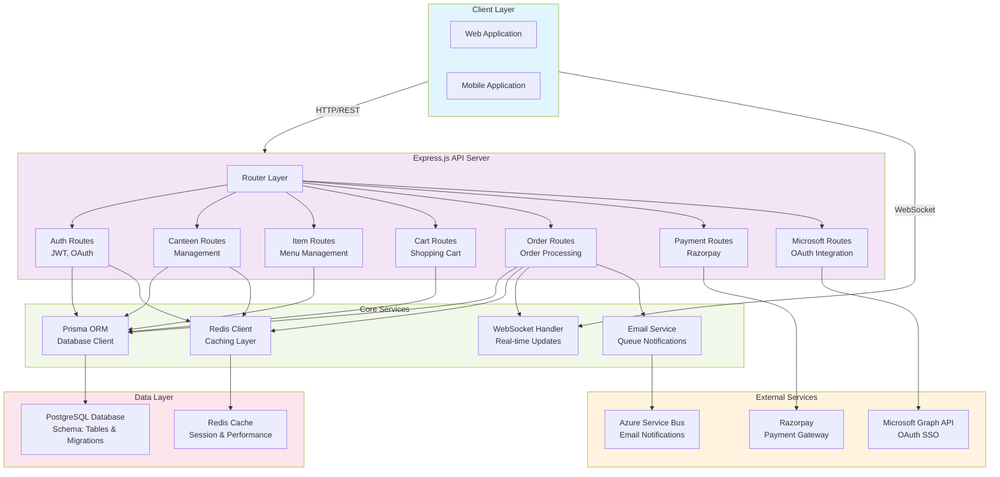

# seeFood Backend

A comprehensive backend API for the seeFood campus canteen management system. Built with Node.js, Express.js, and PostgreSQL, this system manages canteen operations, food ordering, payments, and student authentication.

## Overview

seeFood Backend is the core service that powers the campus canteen management application. It handles multiple canteens, food item management, shopping carts, order processing, payment integration, and real-time updates through WebSockets. The system supports both student and administrator roles with secure JWT-based authentication and optional Microsoft OAuth integration.

## Features

- **Multi-Canteen Management** - Support for multiple canteens with independent menus
- **Student Authentication** - Email/password registration and login with JWT tokens
- **Microsoft OAuth Integration** - SSO authentication via Microsoft accounts
- **Admin & Cashier Roles** - Different access levels for staff management
- **Shopping Cart System** - Add/remove items, manage quantities
- **Order Processing** - Create, track, and manage food orders with status updates
- **Payment Integration** - Razorpay payment gateway for secure transactions
- **Real-Time Updates** - WebSocket support for live order status notifications
- **Redis Caching** - Performance optimization with Redis caching layer
- **Comprehensive Testing** - Unit tests with Jest and E2E tests with Playwright
- **Database Migrations** - Prisma migrations for schema versioning
- **Input Validation** - Secure request validation and sanitization

## Tech Stack

- **Runtime** - Node.js
- **Framework** - Express.js 5.2.1
- **Database** - PostgreSQL
- **ORM** - Prisma 5.22.0
- **Authentication** - JWT, bcryptjs
- **Payment** - Razorpay
- **Caching** - Redis
- **Real-Time** - WebSockets
- **Testing** - Jest, Playwright
- **Development** - Nodemon

## Project Structure

```
.
├── routes/                 # API route handlers
│   ├── auth/              # Authentication endpoints
│   ├── canteens/          # Canteen management
│   ├── items/             # Food items
│   ├── cart/              # Shopping cart
│   ├── orders/            # Order management
│   ├── payments/          # Payment processing
│   └── microsoft/         # Microsoft OAuth
├── lib/                   # Core libraries
│   ├── prisma.js         # Prisma client
│   ├── redis.js          # Redis connection
│   └── ws.js             # WebSocket handler
├── prisma/               # Database schema and migrations
├── tests/                # Test files
│   ├── unit/             # Unit tests
│   └── e2e/              # End-to-end tests
├── server.js             # Application entry point
├── .env                  # Environment variables
└── package.json          # Dependencies and scripts
```

## System Architecture

The seeFood backend follows a layered architecture pattern with clear separation of concerns:

### Architecture Diagram



### Architecture Components

- **Client Layer**: Web and mobile applications that consume REST APIs and WebSocket connections
- **API Server**: Express.js server handling all HTTP requests with middleware for authentication, validation, and CORS
- **Route Handlers**: Modular route handlers for different features (authentication, canteen management, etc.)
- **Core Services**: 
  - Prisma ORM for database operations
  - Redis for caching and session management
  - WebSocket handler for real-time notifications
- **Data Layer**: PostgreSQL database with Prisma migrations and Redis cache
- **External Integrations**: Third-party services for payments, SSO, and notifications

## Getting Started

### Prerequisites

- Node.js (v18 or higher)
- PostgreSQL (v14 or higher)
- Redis (for caching and real-time features)
- npm or yarn

### Installation

1. Clone the repository:
```bash
git clone <repo-url>
cd seeFood_Backend
```

2. Install dependencies:
```bash
npm install
```

3. Configure environment variables:
```bash
cp .env.example .env
# Edit .env with your configuration
```

4. Set up the database:
```bash
npx prisma migrate dev
npx prisma generate
```

5. Start the development server:
```bash
npm run dev
```

The API will be available at `http://localhost:3000`


